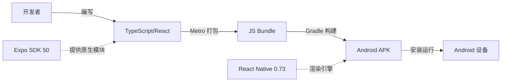

# 迷你桥牌

## 🚀 项目简介与核心业务

**迷你桥牌**是一款基于 React Native + Expo 开发的移动端桥牌游戏应用，专为桥牌爱好者设计，提供简洁流畅的单机对战体验。

### 核心业务功能矩阵

| 功能模块 | 功能描述 | 实现状态 |
|---------|---------|---------|
| **牌制选择** | 支持多种桥牌牌制（自然叫牌法、精确叫牌法等） | ✅ 已实现 |
| **审牌界面** | 展示玩家手牌，支持查看牌型分布 | ✅ 已实现 |
| **叫牌流程** | 完整的叫牌阶段，支持各种叫品 | ✅ 已实现 |
| **打牌流程** | 规范的出牌逻辑，遵循桥牌规则 | ✅ 已实现 |
| **AI 对战** | 内置 AI 引擎，支持人机对战 | ✅ 已实现 |
| **墩牌结算** | 自动计算每墩牌归属，更新比分 | ✅ 已实现 |
| **牌局回顾** | 支持查看历史牌局记录 | ✅ 已实现 |
| **独立运行** | 不依赖 Expo Go 或 Metro 服务器 | ✅ 已实现 |

---

## 🏗️ 技术架构与全局视角

### 整体架构模式

本项目采用 **React Native 跨平台架构**，以 Expo 作为开发框架，通过 **Metro 打包器** 将 JavaScript 代码打包为原生 Android APK。



### 核心技术栈

| 技术/库 | 版本 | 职责说明 |
|---------|------|---------|
| **Expo SDK** | 50.0.0 | 提供跨平台原生模块和开发工具链 |
| **React Native** | 0.73.0 | 核心跨平台渲染框架 |
| **React** | 18.2.0 | UI 组件声明式开发 |
| **TypeScript** | 5.1.3 | 类型安全和代码可维护性 |
| **Metro** | 0.80.12 | JavaScript 打包工具 |
| **Gradle** | 8.3 | Android 原生构建系统 |

### 项目目录结构

```
BridgeGame/
├── 📄 App.tsx                 # 主应用入口（游戏主逻辑）
├── 📄 index.ts                # Expo 应用入口
├── 📄 app.json                # Expo 配置（应用名、包名等）
├── 📄 package.json            # 依赖管理
├── 📄 build-android.sh        # Android 一键构建脚本 ⭐
├── 📁 android/                # 原生 Android 项目（由 prebuild 生成）
│   └── 📁 app/src/main/res/   # 原生资源（colors.xml、strings.xml）
└── 📁 src/
    ├── 📁 screens/            # 页面组件
    │   ├── HandReviewScreen.tsx   # 牌局回顾
    │   └── ...
    ├── 📁 utils/              # 工具类
    │   ├── AIEngine.ts        # AI 引擎
    │   └── ...
    ├── 📁 types/              # TypeScript 类型定义
    └── 📁 components/         # 可复用组件
```

---

## 🔍 核心技术亮点与专项治理

### 专项一：独立 APK 构建方案（离线运行）

**【痛点背景】**
传统的 Expo Debug 构建默认依赖 Metro 开发服务器和 Expo Go 应用，无法满足"独立运行"的需求。用户希望安装 APK 后无需额外环境即可直接启动游戏。

**【核心原理】**
通过 `react-native bundle` 命令将 JavaScript 代码**预打包**为静态 Bundle，嵌入到 APK 的 assets 目录中。应用启动时直接从本地加载 Bundle，而非远程 Metro 服务器。

**【代码落地】**

关键脚本：`/Users/zhaoyang.wzy/work/BridgeGame/build-android.sh`

```bash
# 步骤1：打包 JS Bundle（关键参数 --dev false 表示生产模式）
npx react-native bundle \
  --platform android \
  --dev false \
  --entry-file node_modules/expo/AppEntry.js \
  --bundle-output android/app/src/main/assets/index.android.bundle \
  --assets-dest android/app/src/main/res/ \
  --reset-cache

# 步骤2：Gradle 构建 Debug APK
./gradlew clean assembleDebug
```

**环境变量配置：**
```bash
export METRO_NO_WATCH=true  # 禁用 Metro 的文件监听
export CI=true              # CI 模式，避免交互式提示
ulimit -n 4096              # 增大文件描述符限制，防止 EMFILE 错误
```

---

### 专项二：资源缺失修复（colors.xml 治理）

**【痛点背景】**
Expo SDK 50 生成的 Android 项目在首次构建时，频繁出现 `color/splashscreen_background not found` 和 `color/colorPrimary not found` 错误，导致构建失败。

**【核心原理】**
Expo prebuild 生成的原生项目缺少必要的颜色资源定义。Android 的 AAPT（Android Asset Packaging Tool）在链接资源时严格校验所有引用的资源是否存在。

**【代码落地】**

创建 `/Users/zhaoyang.wzy/work/BridgeGame/android/app/src/main/res/values/colors.xml`：

```xml
<?xml version="1.0" encoding="utf-8"?>
<resources>
    <color name="splashscreen_background">#FFFFFF</color>
    <color name="colorPrimary">#4630EB</color>
    <color name="colorPrimaryDark">#4630EB</color>
</resources>
```

---

### 专项三：AI 引擎防抖机制

**【痛点背景】**
早期版本中 AI 出牌逻辑存在时序竞态，偶发卡顿或无响应现象。

**【核心原理】**
通过 `useEffect` + `setTimeout` 建立**兜底超时机制**，当 AI 思考超过 5 秒未出牌时，自动触发强制出牌逻辑，确保游戏流程不中断。

**【代码落地】**

位置：`/Users/zhaoyang.wzy/work/BridgeGame/App.tsx`

```typescript
// 兜底超时机制：当玩家卡住超过5秒时自动强制出牌
useEffect(() => {
  if (gameState && gameState.currentPlayer !== 'SOUTH') {
    const timeoutId = setTimeout(() => {
      if (gameState.currentPlayer !== 'SOUTH' && !gameState.isGameOver) {
        console.log('AI兜底超时，强制出牌');
        // 强制AI执行出牌
        handleAITurn();
      }
    }, 5000);
    return () => clearTimeout(timeoutId);
  }
}, [gameState?.currentPlayer, gameState?.trickCards]);
```

---

## ⚡ 避坑指南与架构思考

### 避坑一：Expo SDK 版本兼容性

**问题现象：**
- 使用 Expo SDK 52 时，Gradle 构建频繁出现 `expo-modules-core` 相关错误
- Metro 打包时找不到配置文件

**解决方案：**
降级至 **Expo SDK 50** + **React Native 0.73**，与 `CreditReporter` 成功项目对齐，确保构建稳定性。

### 避坑二：Debug APK 独立运行

**认知误区：**
> "Debug 包必须依赖 Metro 服务器"

**实际情况：**
通过 `--dev false` 参数打包的 JS Bundle 已包含完整代码，Debug APK 可以像 Release 包一样独立运行。区别仅在于：
- Debug 包包含调试符号
- Debug 包启用开发菜单
- 文件体积略大

### 架构思考：为什么不使用 EAS Build？

考虑到离线开发和构建可控性，本项目采用**本地 Gradle 构建**方案：
- ✅ 无需 Expo 账号和 EAS 服务
- ✅ 构建过程完全本地可控
- ✅ 适合国内网络环境

---

## 🚀 快速启动与使用指南

### 环境要求

| 工具 | 版本要求 |
|------|---------|
| Node.js | >= 18.0.0 |
| npm | >= 9.0.0 |
| Android Studio | 2023.x 或更高 |
| JDK | 17 |

### 安装依赖

```bash
npm install
```

### 开发模式运行

```bash
npx expo start
```

扫描终端显示的二维码，使用 Expo Go 应用预览。

### 构建独立 APK

```bash
# 一键构建并安装到连接的设备
./build-android.sh
```

构建产物：
- 位置：`android/app/build/outputs/apk/debug/app-debug.apk`
- 复制：`bridgegame-debug.apk`（项目根目录）
- 大小：约 156MB

### 手动安装 APK

```bash
adb install -r bridgegame-debug.apk
```

---
